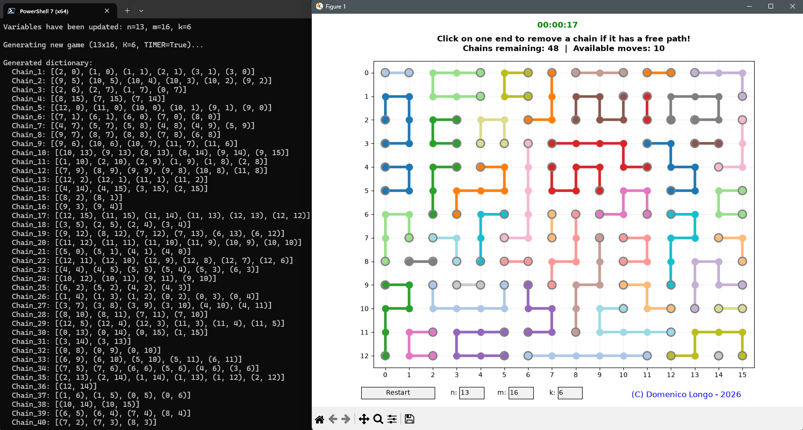

# Chains Game 🐍

A simple interactive Python game implemented in `chains.py`.

This project demonstrates a basic implementation of the classic "Arrows" or "Chains" game using Python; for beginners or educational purposes.



## 📦 Features

- Simple and interactive gameplay
- Mouse-controlled
- Clean and minimal code structure

## 🚀 Getting Started

### Prerequisites
- Python 3.x
- MatPlotLib

### Run the Game
```bash
py chains.py -h
usage: chains.py [-h] [-n N] [-m M] [-k K] [--timer | --no-timer]

Puzzle Game: Clear the grid of orthogonal chains.

options:
  -h, --help           show this help message and exit
  -n N                 Number of matrix rows (N)
  -m M                 Number of matrix columns (M)
  -k K                 Maximum length of each chain (K)
  --timer, --no-timer  Enable or disable game timer (default: True)
```
  
## 📄 License
This project is licensed under the MIT License.  

## 🙌 Contributions
Feel free to fork and improve!
